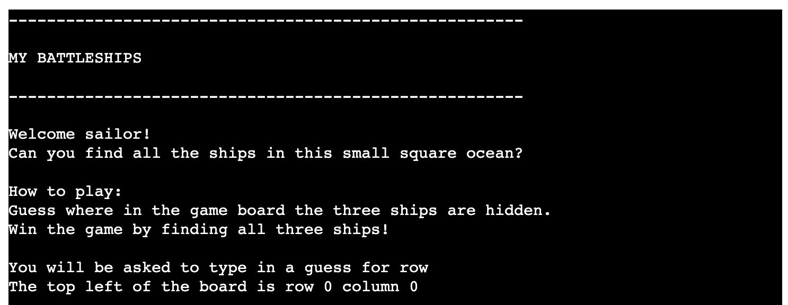
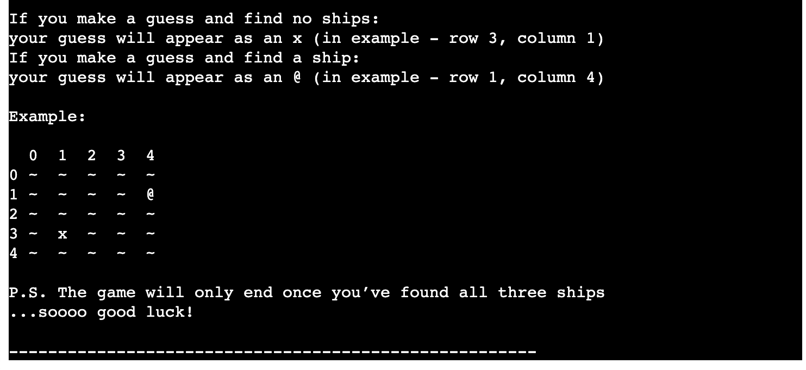
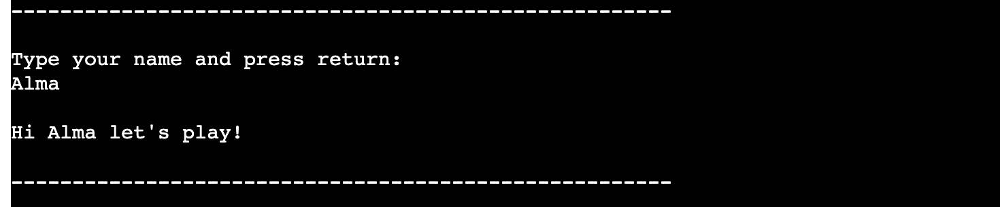
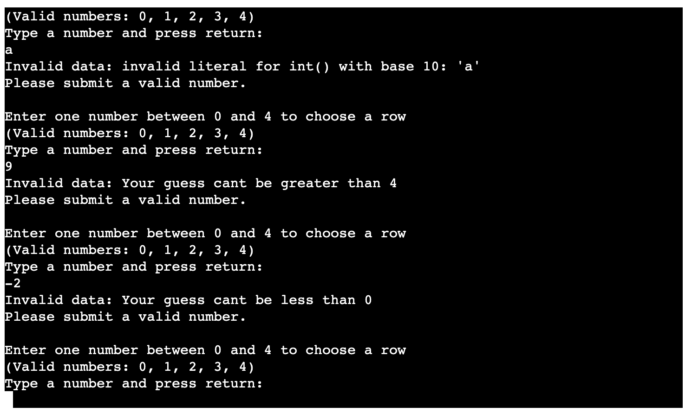
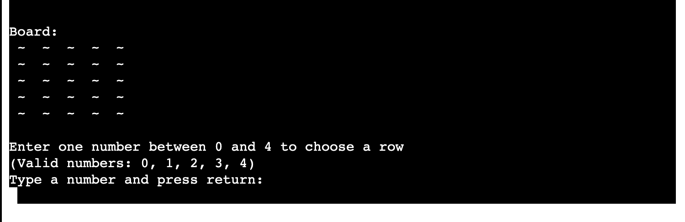
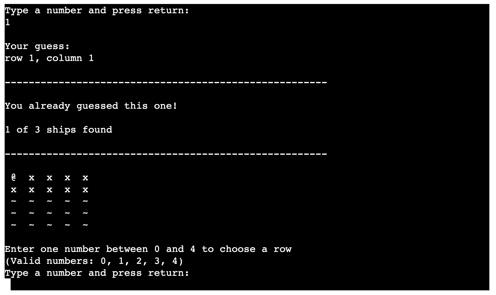
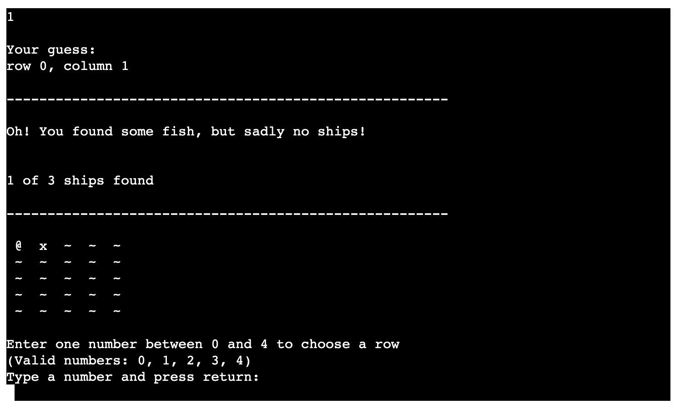
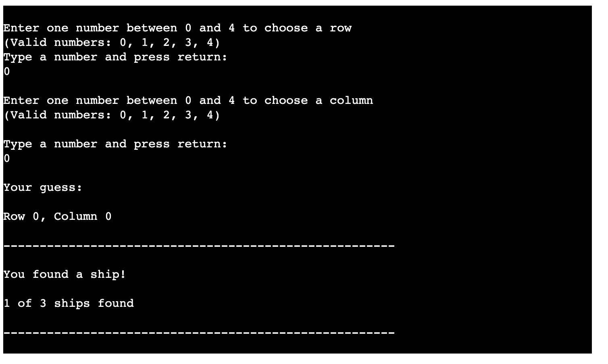
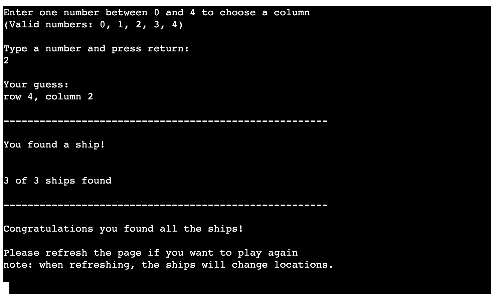

# My Battleships

My battleships is a one player guessing game inspired by the classic game battle ships.

link to live version of project

am i responsive screen dump

## How to play

The User is given a board with three ships hidden in random positions and is asked to guess their location.
The game ends when the user has found all the ships.

## Features

### Existing Fatures

 - Start message
   - Welcome user to game
   - Information on how to play
   - Example of board and how to guess position

- Input name - personalized welcome to game
    - Computer ask for player name
    - When name is received says hello

- Game Start
    - Requirements for valid guess is shown
    - Player can enter a guess for row
    - if guess is not valid error message will show and player will be asked to choose a different value
    
    - If guess is valid, player can enter a guess for column
    

- Result of guess
    - Show results of player guess (board and how many ships found)
    - If row + column has already been guess the user will be informed and asked to guess something else
    
    - If user didn't find a ship an x will appear on the board and input for guessing row will appear
    
    - If user found a ship a @ will appear on the board
    

- Game End
    - When all ships are found game ends
    - Instructions for user on how to play again
    

### Future Features
 - User can decide board dimensions
 - User can decide number of ships
 - Player has their own board with ships that computer tries to find

## Testing

how did i test the project?
 - passed through a validation service?
 - The game has been tested manually in the terminal and with codeanywhere

## Bugs

### Solved Bugs

 - The user was able to guess for the same ship over and over and score would update. fixed by adding if statement

### Remaining Bugs

- No detected bugs

### Validator Testing

- PEP8
  - result from PEP8online.com

## Deployment

This project was deployed by using Code Institute's mock terminal for Heroku.

- steps for deployment:
  - Fork or clone this repository
  - Create a new Heroku app
  - Set the buildpacks to Python and NodeJs in that order
  - Click on deploy

## Credits

- Code institute for the deployment terminal (https://codeinstitute.net/)
- Wikipedia for info about battleships game (https://en.wikipedia.org/wiki/Battleship_(game))
- Code Institute Python course content for referencing and bug solving (https://codeinstitute.net/)
- W3schools python content for referencing and bug solving (https://www.w3schools.com/python/default.asp)